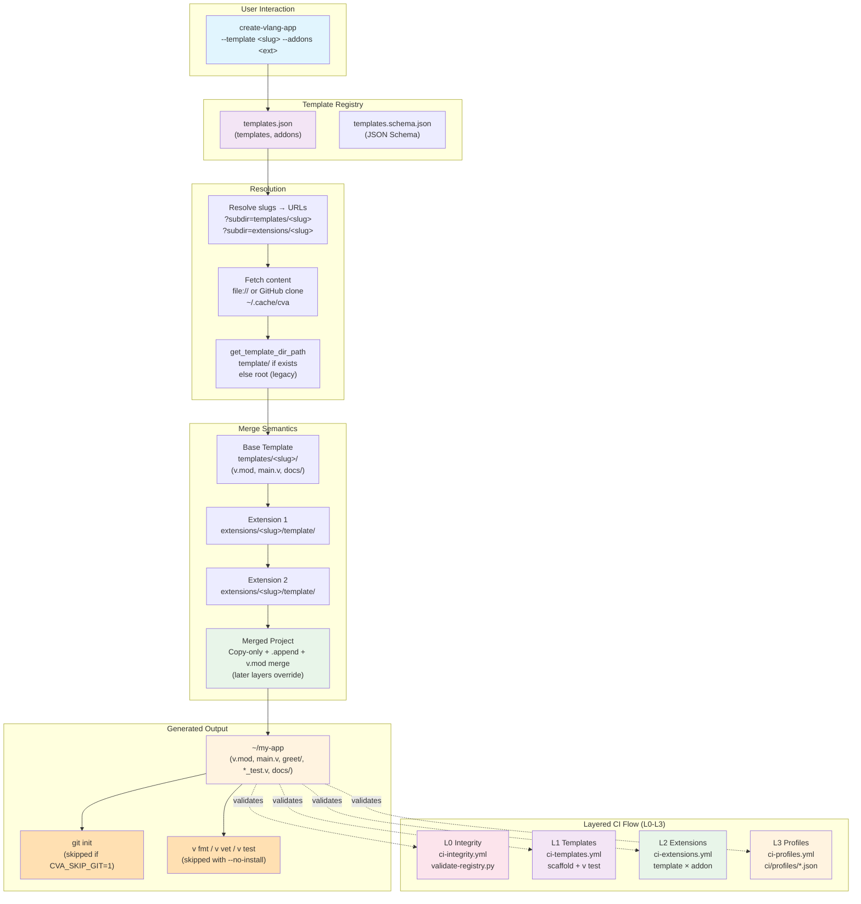

# Architecture

## Overview



This repository is the **template bank** for [create-vlang-app](https://github.com/Create-Vlang-App/create-vlang-app). It mirrors the CNA/CPA split: a CLI engine plus a catalog-backed content repo.

## Components

| Piece | Role |
|-------|------|
| `templates.json` | Machine-readable catalog (templates + addons) |
| `templates.schema.json` | JSON Schema validation for the catalog |
| `templates/<slug>/` | Base project skeletons (copied as project root) |
| `extensions/<slug>/` | Addon metadata + README at root |
| `extensions/<slug>/template/` | Overlay files merged onto a template |
| `scripts/ci/` | Layered CI matrix generation and scaffold checks |
| `ci/profiles/` | Curated L3 profile definitions |

## Template vs extension

```text
templates/web-server/          →  project files
extensions/github-setup/
  README.md                    →  bank docs only (not merged)
  template/.github/...         →  merged into the project
```

The CLI (`create-vlang-app-core`) uses `get_template_dir_path`:

1. If `<source>/template/` exists → use that directory as the copy root.
2. Else → use `<source>/` (legacy flat extensions).

All bank extensions must ship the nested `template/` layout so overlays stay consistent with CPA/CNA.

## Resolution model

The CLI resolves catalog slugs to URLs, then fetches content:

1. Load `templates.json` (remote raw URL or `--catalog-path`).
2. Map `--template web-server` → entry URL.
3. Parse `?subdir=templates/web-server` from GitHub URLs.
4. Clone/cache the repo and copy the template directory into the target project.
5. Repeat for each `--addons` entry; resolve each addon’s `template/` overlay; later layers override earlier files.

See `create-vlang-app-core` `paths.v` and `installer.v` for implementation details.

## URL convention

Canonical registry URLs use the monorepo root plus a query subdir:

```text
https://github.com/Create-Vlang-App/cva-templates?subdir=templates/web-server
https://github.com/Create-Vlang-App/cva-templates?subdir=extensions/github-setup
```

Local CI uses `file://` with the same query form:

```text
file:///path/to/cva-templates?subdir=templates/web-server
```

The `subdir` always points at the **catalog entry root** (`templates/<slug>` or `extensions/<slug>`), not at `template/` — the core loader peels `template/` when present.

## Merge semantics

- **Templates** provide `v.mod`, source tree, tests, and `docs/`.
- **Extensions** overlay files from `template/` (workflows, Docker, env samples, guides) without replacing the whole project.
- When multiple layers define `v.mod`, the installer merges module metadata.

## Feature layout inside templates

Primary templates use V-native feature modules (top-level directories matching `import` names). See [AUTHORING.md](AUTHORING.md).

## Layered CI (L0–L3)

| Layer | Workflow | Validates |
|-------|----------|-----------|
| L0 | `ci-integrity.yml` | Schema, on-disk paths, docs bar, extension `template/`, profiles |
| L1 | `ci-templates.yml` | Each template scaffolds and passes `v test` |
| L2 | `ci-extensions.yml` | Template × compatible addon combinations |
| L3 | `ci-profiles.yml` | Curated real-world stacks in `ci/profiles/` |

## Compatibility fields

Addons may declare:

- `compatibleWith` — limit to specific template slugs
- `incompatibleWith` — block conflicting addon pairs (enforced in L3 profiles)

## Related docs

- [TESTING.md](TESTING.md) — local verification
- [AUTHORING.md](AUTHORING.md) — contributing new entries
- [MAINTENANCE_CI.md](MAINTENANCE_CI.md) — triage when CI fails


## Domain catalog

Scientific/ML/reactive growth follows [DOMAIN_AUTHORING.md](./DOMAIN_AUTHORING.md).
